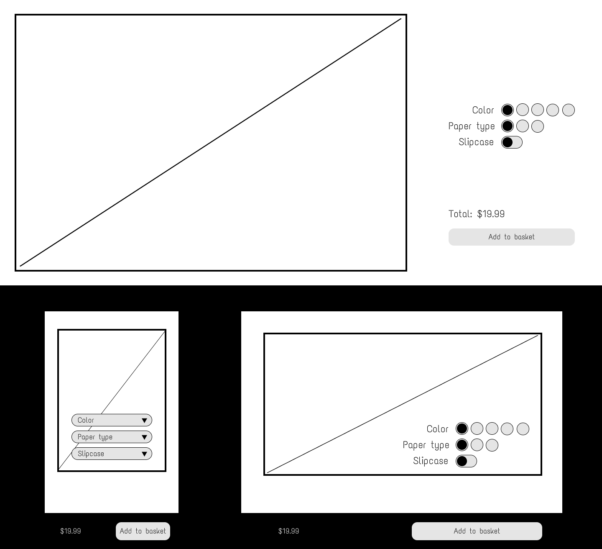

# Front End Technical Assignment

We’d like you to design, build and test a Product Configurator component that can be used in a web application or website. The component allows a customer to configure certain attributes of a product before they purchase. It should meet the following requirements:

- As a customer, I want to be able to choose between different options on a type of product, so that I can define the product I wish to buy
- As a keyboard user, I want be able to choose between different options on a type of product without a mouse, so that I can define the product I wish to buy
- As a customer, I want to see a summary of the options I have selected, so that I am confident of the product I am about to buy
- As a customer, I want to see the total price of the product based on the options I have selected so that I know how much I will spend if I buy the product

You are free to design the component as you see fit, but bear in mind the user experience. There is a basic wireframe below to get you started. The technology choice is down to you, so you can explore and use whatever you think is suitable. We have provided a data structure as an input to your component and a basic colour theme for you to use which you are free to extend / change as you see fit.

## Files

- Product Options component input data - `./productOptionsData.json`
- Theme - `./theme.js`

## Wireframe

